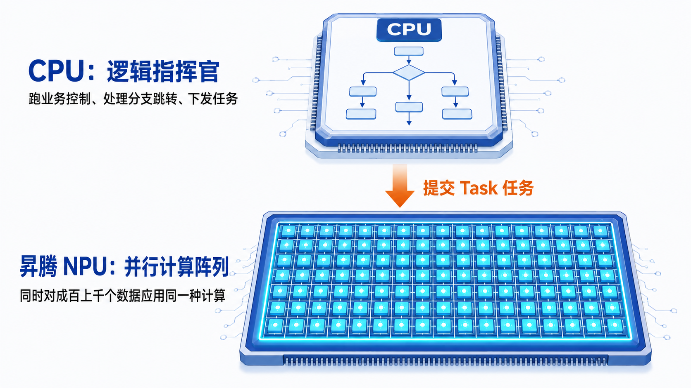
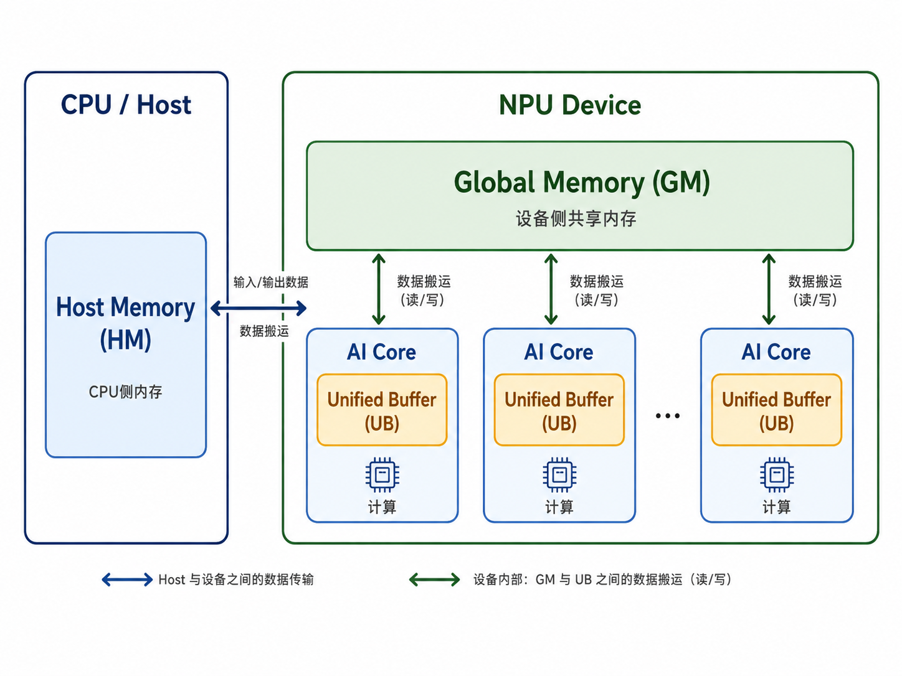

# 动手学昇腾算子开发

## 第一章 从 Add 开始理解昇腾算子开发

### 第一节 认识昇腾算子开发

#### 一、大模型时代下的 NPU 与大规模并行计算

从 Transformer 架构到大语言模型（LLM）的爆发，AI 时代的计算范式发生了根本改变：我们不再处理简单的小规模数值计算，而是每秒都需要对海量张量（Tensor）进行巨量的矩阵乘法和向量加减。这种计算有两个极端的特点：**计算规则极其固定，但数据吞吐量极其巨大**。

面对这种需求，传统 CPU 就显得吃力。CPU 的设计更像一个“全能的高管”：它擅长处理复杂的逻辑判断、分支跳转和操作系统调度，但核心数量有限，大量芯片资源用于控制与缓存，难以提供大规模数据并行计算所需的吞吐能力。

为了突破算力与带宽瓶颈，**昇腾 AI 加速卡**应运而生。日常交流中常把它俗称为“昇腾显卡”，但它并不是用于游戏图形渲染的设备，而是专门为大模型计算打造的“并行算力工厂”；其中承担大规模张量计算的核心处理器称为 **NPU（Neural Processing Unit，神经网络处理器）**。

##### （一）CPU 负责控制，NPU 负责并行

在 AI 服务器中，CPU 和 NPU 并不是替代关系，而是分工明确的协作搭档：

两者的核心差异在于处理任务的方式不同：

- **CPU，擅长“找逻辑”。** 负责 Token 预处理、条件分支判断和任务调度。它适合决定“下一步做什么”。
- **NPU，擅长“拉流水线”。** 负责矩阵乘法、卷积以及各类张量运算。它拥有大量计算单元，适合对海量数据执行高并发的规则计算。

让 CPU 管控制，让 NPU 跑算力，才能最大化整个系统的吞吐性能。

#### 二、昇腾 NPU 的架构与并行抽象

昇腾 NPU 并不是一个单体 CPU，而是一个高度集成的多核并行计算设备。理解 NPU 如何将一个高层算子任务拆解到物理硬件上，是编写高性能 Kernel 的核心前提。

*图 1-2：Host 与 NPU 之间传递输入输出；NPU 的 GM 保存完整数据，各 AI Core 读取自己负责的片段并在本地工作区完成计算。*

##### 1. AI Core：物理计算核心与底层硬件构成

AI Core 是昇腾 NPU 内部最核心的独立物理计算单元。每个 AI Core 都集成了独立的算力引擎、内存搬运单元与片上高速存储：

- **Vector 单元（向量引擎）**：负责向量与标量计算的硬件执行单元。支持 SIMD（单指令多数据）范式，一条指令即可在一个时钟周期内并发吞吐上百个连续元素的运算。
- **Cube 单元（矩阵引擎）**：专门面向矩阵乘法（MatMul）与卷积（Conv）的高密算力单元，能在硬件层面快速吞吐二维矩阵运算。
- **Unified Buffer（UB，片上高速缓存）**：AI Core 内部的片上 SRAM。读写延迟极低，但物理容量极其昂贵且有限（通常仅 `256 KB`），用于保存当前计算单元直接引用的输入与输出工作集。
- **MTE（Memory Transfer Engine，内存搬运引擎）**：独立的 DMA 数据搬运单元。专门负责在片外大容量显存（Global Memory，GM）与片上 UB 之间做高带宽数据传输。

在硬件执行管线中，算子所需的完整张量通常保存在片外 GM 中；计算时由 MTE 引擎将数据搬入 UB，Vector/Cube 单元在 UB 中完成计算，最后由 MTE 将结果写回 GM。

##### 2. Block：空间维度的多核任务切分

Block 是昇腾算子在空间多核并行维度上的逻辑任务划分单位。

当 CPU 启动一个 Kernel 时，会指定本次任务包含多少个 Block。NPU 内部的硬件调度器（Task Scheduler）会自动把这些逻辑 Block 分发给多个物理 AI Core 去并发执行。

在算子开发中，巨大的张量数据会被划分为多个互不重叠的数据段。每个 Block 内部通过硬件提供的 `block_idx`（逻辑 Block 编号）计算出属于当前任务的数据偏移量，实现“同一份 Kernel 代码，多个 Block 并发处理不同数据区域”的空间多核并行。

需要明确的是：`block_idx` 表示的是逻辑任务编号而非固定的物理 AI Core ID。调度器会根据 AI Core 的空闲状态动态分发 Block，从而确保物理算力被充分压榨。

#### 三、昇腾 NPU 算子的高性能来源

对规则固定、数据量足够大且具有数据并行性的张量计算，昇腾 NPU 能够充分利用专为 AI 负载设计的硬件。性能并非来自某一条加法指令，而是来自向量计算、多 Core 执行和异步流水线的共同作用。

**1. SIMD 向量计算带来高吞吐量**

Add 不必写成“取一个数、加一次、再取下一个数”的标量循环。AI Core 的 Vector 单元可以用一条 SIMD（Single Instruction, Multiple Data）指令处理一批连续元素，从而在单位时间内完成大量相加操作。

**2. 多 AI Core 带来空间并行**

一个很长的向量可以被划分为多个连续数据段。每一段对应一个 Block，即同一份 Kernel 的一个逻辑执行任务；多个 AI Core 可以同时执行这些 Block。每个 Core 负责不同的数据区域，整个 NPU 因此能够同时推进许多相互独立的计算任务。

**3. 搬运与计算解耦的异步流水线**

AI Core 内部既有负责数据搬运的 MTE（Memory Transfer Engine），也有负责向量计算的 Vector 单元。MTE 可以在 Global Memory（GM）与 Unified Buffer（UB）之间搬运数据，Vector 单元则在 UB 中执行计算。不同单元能够处理不同数据块的工作，因此读数据、计算、写回可以形成异步流水线；源码按顺序发出命令，并不意味着硬件必须按顺序完成所有命令。

#### 四、初学昇腾算子开发的三类挑战

这些硬件能力带来速度，也要求开发者在代码中显式处理以下关系：

1. **显式内存层级管理。** GM 是设备侧的大容量共享内存，适合保存完整输入输出；UB 是 AI Core 内部容量较小、速度更高的片上 Local Memory，适合保存当前计算的数据段。算子必须明确控制数据何时从 GM 搬入 UB、何时写回 GM，而不能把两者当成同一种内存。
2. **多 Core 任务切分与数据分块。** 同一份 Kernel 需要将完整输入划分为多个 Block，交给多个 AI Core 执行。当一个 Block 的数据仍然超过 UB 容量时，还要继续切成多个 Tile，即可放入 UB 的连续小数据段，分批处理。这里既要保证不同任务覆盖完整数据且不重复，也要让每一小段数据符合片上存储限制。
3. **核内流水线编排与同步控制。** MTE 搬运和 Vector 计算可以异步推进，但数据没有搬入完成就不能开始计算，结果没有计算完成也不能写回。要让读、算、写安全重叠，程序需要表达这些依赖关系；后文将用同步操作和双缓冲逐步解决这一问题。

这三类挑战分别对应内存管理、任务划分和并行控制，也是昇腾算子代码比普通顺序程序更需要仔细设计的原因。

#### 五、本章的学习路线

本章将以 Add 为例，由浅入深地讲解上述硬件性能来源，以及实现它们时的三类开发挑战：

1. **第二节：建立第一个 Add 的执行方案。** 将本节的 GM、UB 与 Vector 架构落实到固定长度 Add，完成“GM 搬入 UB、向量加法、写回 GM”的最简 Kernel 闭环。
2. **第三节和第四节：掌握 Ascend C 的两种表达方式。** 在相同 Add 路径上，分别使用指针风格的 SIMD C API 与张量对象风格的 C++ API，表达地址、局部缓冲区、搬运和计算。
3. **第五节：解决片上存储容量限制。** 当一个 Block 的数据无法放入 UB 时，引入 Tile，将大任务拆成多次搬入和计算的小段。
4. **第六节：利用异步流水线减少等待。** 通过同步关系和双缓冲，让不同 Tile 的搬运、计算和写回尽可能重叠。
