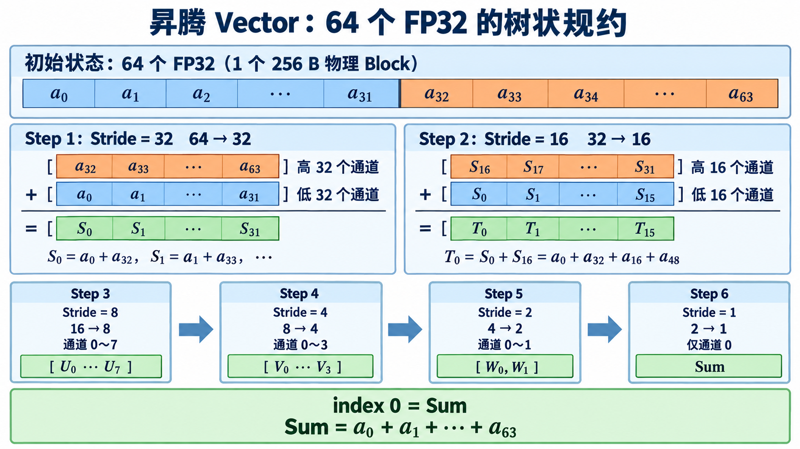

## 第二章 从 Reduce Sum 开始理解归约算子

### 第一节 归约计算的物理本质：树状归约与片上数据折叠

上一章围绕逐元素算子（如 Add）构建了 AIV（Vector Core）上的数据流水线。逐元素算子的数据流是点对点的：输入多少个元素，输出就有多少个元素，每个计算通道互不干扰。

深度学习中还存在另一类完全不同的算子：归约（Reduce）算子，如 Softmax、LayerNorm、Loss 计算等。Reduce Sum 将一个长向量收敛为一个标量，是典型的数据折叠：

$$
y = \sum_{i=0}^{N-1} x_i
$$

在传统 CPU 上，归约通常被直觉地实现为串行的 `for` 循环，即用一个标量累加器逐个吞入数据。但在昇腾 AI Core 这种专用向量加速芯片上，串行处理会造成巨大的计算单元浪费。AI Core 的设计核心是高吞吐的矢量并行，其硬件单次指令执行、寄存器读写以及片上内存搬运的基础物理粒度均为 `256 B`。

为了在矢量架构下高效完成数据归约，算子的物理设计必须从“串行累加”转向“片上向量折叠”。

#### 一、单 Core 片上：树状规约与 256 B 物理粒度

在昇腾 AI Core 中，Vector 单元单次指令的操作空间为 `256 B`。对于 `float32` 类型（每个元素占 `4 B`），这 `256 B` 物理空间恰好可以装入 `64` 个元素。

为了高效处理这 `256 B` 数据，Vector 单元不会像 CPU 那样逐个串行累加，而是采用一种**并行树状折叠算法（Tree Reduction）**。

当 `64` 个 `float32` 元素装满单个 `256 B` 向量寄存器后，硬件会在 `6` 轮（$\log_2 64 = 6$）内对这个寄存器进行高低半区对折相加，把数据迅速收敛到 `index 0` 位置：

- **初始状态**：`256 B` 向量寄存器装入 `64` 个 FP32 元素，即 `a0` 到 `a63`。
- **第一轮（Stride = 32）**：寄存器后半段 `a32` 到 `a63` 与前半段 `a0` 到 `a31` 并行相加，`32` 个通道并发计算，生成 `32` 个局部和 `S0` 到 `S31`，其中 `S0 = a0 + a32`。
- **第二轮（Stride = 16）**：剩下的后半段 `S16` 到 `S31` 与前半段 `S0` 到 `S15` 相加，`16` 个通道并发计算，生成 `16` 个局部和 `T0` 到 `T15`，其中 `T0 = S0 + S16`。
- **第三轮（Stride = 8）**：高 `8` 个元素与低 `8` 个元素并行相加，收敛为 `8` 个元素 `U0` 到 `U7`。
- **第四轮（Stride = 4）**：高 `4` 个元素与低 `4` 个元素并行相加，收敛为 `4` 个元素 `V0` 到 `V3`。
- **第五轮（Stride = 2）**：高 `2` 个元素与低 `2` 个元素并行相加，收敛为 `2` 个元素 `W0` 和 `W1`。
- **第六轮（Stride = 1）**：最后两个元素相加，生成最终的累加和 `Sum`，精确存放在 `index 0` 位置。

*图 2-1：64 个 `float32` 元素在一个 256 B Block 内进行六轮树状折叠，最终的 Sum 位于 `index 0`。*

通过这种按位置对齐的向量树状折叠，计算时间复杂度由传统串行累加的 $O(N)$ 降至 $O(\log_2 N)$。

#### 二、Reduce Sum 的三阶梯题目设计

在掌握单个 AI Core 内部 `256 B` 物理粒度的向量折叠原理后，如果直接编写大规模数据的归约算子，往往会被片上缓存限制、Tile 循环偏移、多核并发竞争以及原子操作等交织在一起的工程细节所干扰。

为了清晰地解耦算子设计的核心矛盾，本章将归约算子的学习路径重构为**三阶梯递进题目设计**。整个物理计算链路被拆解为“单个 Tile 片上折叠 $\rightarrow$ 单 Core 内多 Tile 空间突破 $\rightarrow$ 多 Core 间算力拓展”三个维度。通过循序渐进的关卡设计，读者可以在隔离难点的同时，逐步建立从微观寄存器指令到宏观全芯片协同的算子设计全景图。

| 关卡 | 数据规模 | 架构特征 | 核心设计目标 | 隔离的工程难点 |
| --- | --- | --- | --- | --- |
| **Easy 版本** | `32 KB` `8192` 个 FP32 | 单核、单个 Tile 一次性装入 UB | **聚焦片上规约链路**：掌握数据从 $N$ 到 $1$ 的折叠过程、`256 B` 对齐与 `tmpBuffer` 临时空间分配 | 暂不引入 Tile 循环与多核并发 |
| **Medium 版本** | `2 MB` `524288` 个 FP32 | 单核、多 Tile 循环 突破 UB 容量限制 | **聚焦单核片上累加**：掌握单核 Tiling 策略、Tile 偏移、`sum_buffer` 临时存储及各 Tile 局部和累加 | 中间结果全在单 Core 内管理，不引入跨 Core 汇总 |
| **Hard 版本** | `64 MB` `16777216` 个 FP32 | `32` 个 AI Core 并行 突破单核算力瓶颈 | **聚焦多核 Atomic 写**：掌握基于 `block_idx` 的跨核数据切分、多核竞争与硬件 Atomic Add 使用 | 比较 Atomic 规约与 Two-Stage 规约（WorkSpace 缓存二次归约）的性能差异 |

##### （一）Easy 版本：单核单 Tile

- **题目数据**：`8192` 个 `float32` 元素，共 `32 KB`；输入 `x` 的形状为 `(8192,)`，每个元素范围为 $[-1.0, 1.0]$；输出 `y` 的形状为 `(1,)`，范围为 $[-8192, 8192]$。
- **任务要求**：使用单个 AI Core 处理完整输入，将 `x` 搬入 UB，在片上执行 `WholeReduceSum` 或 `BlockReduceSum`，再将标量结果写回 GM。
- **学习重点**：数据从 $N$ 到 $1$ 的折叠过程、`256 B` 对齐与 `tmpBuffer` 临时空间分配。
- **难点隔离**：暂不引入 Tile 循环与多核并发。

##### （二）Medium 版本：单核多 Tile

- **题目数据**：$2^6 \times 8192 = 524288$ 个 `float32` 元素，共 `2 MB`；输入 `x` 的形状为 `(524288,)`，输出 `y` 的形状为 `(1,)`。
- **任务要求**：仍由单个 AI Core 完成归约。输入必须拆分为多个 Tile，通过循环搬运、片上规约与局部累加得到 Local Sum。
- **学习重点**：单核 Tiling 策略、Tile 偏移、`sum_buffer` 临时存储，以及持续累加各 Tile 局部和的过程。
- **难点隔离**：所有中间结果都在同一个 Core 内管理，不引入跨 Core 汇总。

##### （三）Hard 版本：多 Core 协同与跨核归约

- **题目数据**：$32 \times 2\text{ MB} = 64\text{ MB}$，即 `16777216` 个 `float32` 元素；输入 `x` 的形状为 `(16777216,)`，输出 `y` 的形状为 `(1,)`。
- **任务要求**：将输入均分给 `32` 个 AI Core。每个 Core 先计算 `core_local_sum`，再通过 `SetAtomicAdd` 将局部和安全地累加到同一个 GM 输出地址。
- **学习重点**：基于 `block_idx` 的跨核数据切分、多核写同一输出地址时的竞争问题，以及硬件 Atomic Add 的使用。
- **延伸问题**：比较 Atomic 规约与 Two-Stage 规约。后者通过 WorkSpace 保存各 Core 局部和，再进行第二次归约，以降低原子写带来的开销。
