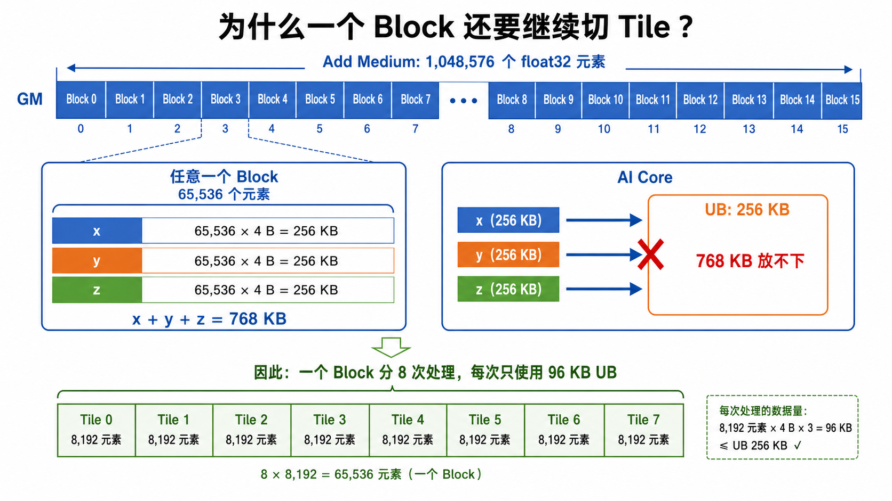

### 第四节 Add Medium：Tile 分块

Easy 版本的长度是 `172032`，使用 `16` 个 Block 后，每个 Block 处理 `10752` 个 `float32` 元素。这一段数据对应的三块 UB 缓冲区 `x`、`y`、`z` 共占用 `126 KB`，可以一次搬入 UB 后完成计算。

Add Medium 将向量长度扩大到：

$$
N = 1048576
$$

本节仍然处理 `float32` 的逐元素加法，但每个 Block 接到的数据已经无法一次放进 UB。解决办法是：一个 Block 负责一段连续的数据，再把这段数据拆成若干个 Tile，逐个搬运和计算。

#### 一、为什么需要 Tile 分块

先保持 `16` 个 Block。此时每个 Block 负责：

$$
\text{BLOCK\_LENGTH} = 1048576 / 16 = 65536
$$

若把 `65536` 个元素的 `x`、`y`、`z` 全部放入 UB，所需空间为：

$$
3 \times 65536 \times 4\text{ B} = 768\text{ KB}
$$

这远大于一个 AI Core 可供这段程序使用的 UB 空间。GM 可以容纳完整向量，UB 则只保存当前正在计算的一小段数据；因此，不能把整个 Block 一次搬进 UB。



*16 个 Block 将完整向量均分为 16 段；每段的三块完整缓冲区合计为 768 KB，必须继续拆成 Tile 才能进入 UB。*

这里取：

```cpp
constexpr uint32_t NUM_BLOCKS = 16;
constexpr uint32_t BLOCK_LENGTH = 65536;
constexpr uint32_t TILE_LENGTH = 8192;
constexpr uint32_t TILE_NUM = BLOCK_LENGTH / TILE_LENGTH;  // 8
```

每个 Tile 的三块 `float32` 缓冲区占用：

$$
3 \times 8192 \times 4\text{ B} = 98304\text{ B} = 96\text{ KB}
$$

所以，一个 Block 中的 `65536` 个元素被拆成 `8` 个 Tile；每次只让一个 Tile 占用 UB。

#### 二、一个 Block 怎样处理多个 Tile

`block_idx` 决定当前 Block 在完整向量中的起点，`tileIdx` 决定当前处理该 Block 内的哪一小段：

```cpp
const uint32_t blockOffset = block_idx * BLOCK_LENGTH;

for (uint32_t tileIdx = 0; tileIdx < TILE_NUM; ++tileIdx) {
    const uint32_t tileOffset = tileIdx * TILE_LENGTH;
    // 当前 Tile 的 GM 起点：GM 基址 + blockOffset + tileOffset
}
```

以 `Block 0` 为例，它的工作范围是 `[0, 65536)`；循环会依次处理：

```text
Tile 0: [0, 8192)
Tile 1: [8192, 16384)
...
Tile 7: [57344, 65536)
```

每一轮都执行相同的三步：从 GM 读入 `x`、`y` 到 UB，在 UB 中完成 Add，再将 `z` 写回 GM。

```cpp
asc_copy_gm2ub(xLocal, xGm + tileOffset, TILE_LENGTH * sizeof(float));
asc_copy_gm2ub(yLocal, yGm + tileOffset, TILE_LENGTH * sizeof(float));
asc_sync();

asc_add(zLocal, xLocal, yLocal, TILE_LENGTH);
asc_sync();

asc_copy_ub2gm(zGm + tileOffset, zLocal, TILE_LENGTH * sizeof(float));
asc_sync();
```

同一组 `xLocal`、`yLocal`、`zLocal` 会在下一轮循环中复用，因此 UB 的占用始终是一个 Tile 的 `96 KB`，而不是整个 Block 的 `768 KB`。

#### 三、Tile 分块后，为什么还要关注 Block 数量

Tile 解决的是“一个 Block 的数据如何装进 UB”的问题；Block 数量决定的是“这次 Kernel 提交了多少独立任务，运行时有多少任务可以调度到 AI Core 上”。两者分别控制片上存储与任务级并行度。

对于长度为 `1048576` 的 Add，改变 Block 数会改变每个 Block 的工作量：

| Block 数 | 每个 Block 元素数 | 三块完整缓冲区的大小 |
| ---: | ---: | ---: |
| 16 | 65536 | 768 KB |
| 32 | 32768 | 384 KB |
| 64 | 16384 | 192 KB |
| 128 | 8192 | 96 KB |

更多 Block 会让单个 Block 变小，也可能让更多 AI Core 同时获得工作；但并不是固定选择最大的数字。实际设备同时可运行的 AI Core 数有限，超过后其余 Block 会等待调度；过小的 Block 还会增加任务调度与启动开销。`availableCoreNum` 可以提供当前环境的可用 Core 数，最终需要用 profiling 比较不同 `NUM_BLOCKS` 的实际耗时。

本题故意保留 `16` 个 Block：这样每个 Block 的 `65536` 个元素明显超出 UB 一次可容纳的范围，Tile 循环成为代码中不可省略的一部分。

#### 四、完整 kernel.asc

下面的实现固定处理长度为 `1048576` 的 `float32` 向量。每个 Block 处理 `65536` 个元素，并在 Block 内循环完成 `8` 次 Tile 计算。

```cpp
#include <cstdint>
#include "kernel_operator.h"
#include "c_api/asc_simd.h"

constexpr uint32_t NUM_BLOCKS = 16;
constexpr uint32_t BLOCK_LENGTH = 65536;
constexpr uint32_t TILE_LENGTH = 8192;
constexpr uint32_t TILE_NUM = BLOCK_LENGTH / TILE_LENGTH;
constexpr int64_t TOTAL_LENGTH = NUM_BLOCKS * BLOCK_LENGTH;

__vector__ __global__ void add_custom(GM_ADDR x, GM_ADDR y, GM_ADDR z)
{
    asc_init();

    const uint32_t blockOffset = block_idx * BLOCK_LENGTH;
    __gm__ float* xGm = reinterpret_cast<__gm__ float*>(x) + blockOffset;
    __gm__ float* yGm = reinterpret_cast<__gm__ float*>(y) + blockOffset;
    __gm__ float* zGm = reinterpret_cast<__gm__ float*>(z) + blockOffset;

    __ubuf__ float xLocal[TILE_LENGTH];
    __ubuf__ float yLocal[TILE_LENGTH];
    __ubuf__ float zLocal[TILE_LENGTH];

    for (uint32_t tileIdx = 0; tileIdx < TILE_NUM; ++tileIdx) {
        const uint32_t tileOffset = tileIdx * TILE_LENGTH;

        asc_copy_gm2ub(xLocal, xGm + tileOffset, TILE_LENGTH * sizeof(float));
        asc_copy_gm2ub(yLocal, yGm + tileOffset, TILE_LENGTH * sizeof(float));
        asc_sync();

        asc_add(zLocal, xLocal, yLocal, TILE_LENGTH);
        asc_sync();

        asc_copy_ub2gm(zGm + tileOffset, zLocal, TILE_LENGTH * sizeof(float));
        asc_sync();
    }
}

extern "C" void run_kernel(GM_ADDR x, const TensorGroupInfo& info_x,
                           GM_ADDR y, const TensorGroupInfo& info_y,
                           GM_ADDR z, const TensorGroupInfo& info_z,
                           int64_t availableCoreNum, aclrtStream stream)
{
    if (info_x.numTensors != 1 || info_y.numTensors != 1 ||
        info_z.numTensors != 1 || info_x.tensors[0].dtype != 0 ||
        info_y.tensors[0].dtype != 0 || info_z.tensors[0].dtype != 0 ||
        info_x.tensors[0].shape[0] != TOTAL_LENGTH ||
        info_y.tensors[0].shape[0] != TOTAL_LENGTH ||
        info_z.tensors[0].shape[0] != TOTAL_LENGTH ||
        availableCoreNum <= 0) {
        return;
    }

    add_custom<<<NUM_BLOCKS, nullptr, stream>>>(x, y, z);
}
```

#### 五、本节要点

- Tile 把一个 Block 的长数据段拆成可放入 UB 的短数据段。
- `blockOffset` 选择当前 Block 的工作范围，`tileOffset` 选择该范围内当前处理的 Tile。
- Tile 循环反复执行 GM 到 UB、UB 内 Add、UB 到 GM，并复用同一组 UB 数组。
- Block 数量与 Tile 长度是两个独立参数：前者影响任务级并行度，后者决定单次 UB 占用。
