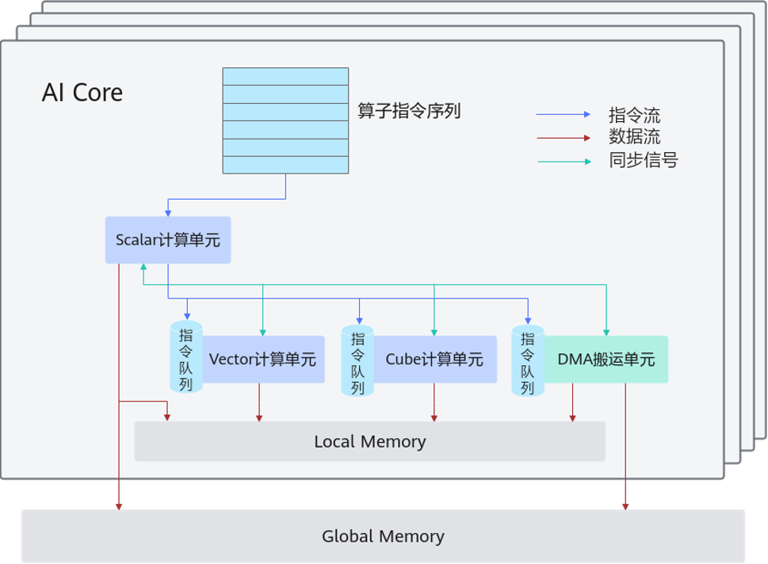

### 第六节 TensorOJ 实战：Add Medium 的双缓冲流水线

本节继续实现 [TensorOJ Add Medium](https://tensoroj.cn/cann/pku-tensor/education/add-medium)，重点优化算子的执行效率。

在上一节中，Tile 循环虽然解决了片上 SRAM 溢出的问题，但 MTE 搬运引擎与 Vector 计算单元只能串行交替运行：Vector 计算时 MTE 只能闲置，MTE 搬运时 Vector 只能等待。

要消除这种硬件空转，核心在于**让“计算当前 Tile”与“搬运下一 Tile”同时进行**。然而在单缓冲区下，预读下一 Tile 会直接覆盖当前正在计算的片上数据，引发数据竞争。

本节将引入**双缓冲（Double Buffering）技术**：通过开辟两套可交替轮换的片上缓冲区（乒乓机制），实现内存搬运与向量计算的并发重叠，彻底拉满硬件算力利用率。

#### 一、异步指令流：双缓冲的硬件基础

##### （一）顺序等待会让计算单元空转

在普通的顺序控制流中，程序往往先等待输入数据搬完，再开始计算，最后等待结果写回。对于大规模向量或矩阵计算，这种“搬完再算”的安排会让计算单元在搬运期间没有工作可做；计算期间，搬运单元也可能处于空闲状态。

AI Core 的目标不是让所有指令严格依次完成，而是让相互独立的硬件单元各自持续处理自己的任务。只要数据依赖允许，下一条搬运指令可以在前一 Tile 的向量计算尚未结束时开始执行。

##### （二）Scalar 将指令发射到独立流水线

AI Core 内部具有多条异构指令队列。Scalar 计算单元负责解析算子指令流，并将计算或搬运指令发射到对应的独立队列；各队列随后由各自的硬件单元异步推进。


*图 6-1：AI Core 将 Cube、Vector、Scalar 与内存搬运指令送入独立队列，使不同硬件单元能够并行推进。*

在 Ascend C 的流水线标识中，常见的计算队列包括标量队列 `PIPE_S`、向量队列 `PIPE_V` 与矩阵队列 `PIPE_M`；内存搬运还细分为 `PIPE_MTE1`、`PIPE_MTE2`、`PIPE_MTE3` 和 `PIPE_FIX` 等队列。本节的 Add 不使用 Cube 矩阵计算，重点涉及：

- `PIPE_MTE2`：将输入 Tile 从 GM 搬入片上工作区。
- `PIPE_V`：对 UB 中的 `float32` Tile 执行向量 Add。
- `PIPE_MTE3`：将输出 Tile 从片上工作区写回 GM。



*图 6-2：Scalar 发射指令；Vector、Cube 与 DMA 搬运单元通过各自队列执行。指令流可以并行推进，数据依赖仍需要同步关系约束。*

异步队列提供了重叠的硬件能力，但不会自动消除数据依赖。同一块 UB Buffer 同时被读写仍会产生数据竞争；要让 MTE2 搬入 Tile `i + 1` 与 Vector 计算 Tile `i` 真正并行，两个 Tile 必须拥有彼此独立的局部工作区。这正是双缓冲需要解决的资源问题。

#### 二、双缓冲如何解除资源冲突

第五节的单缓冲代码只有一套 UB 工作区：`xLocal`、`yLocal`、`zLocal`。当 Vector 单元正在读取其中的 Tile `i` 时，MTE2 不能把 Tile `i + 1` 搬到同一位置；否则新数据会覆盖仍在参与计算的旧数据。于是，下一次搬入只能等待当前计算结束。

双缓冲的做法不是把一个 Tile 算两遍，而是为每种局部数据准备两块可轮换的 UB Buffer。这样可以让两个相邻 Tile 同时处于不同阶段：

```text
Buffer 0: Tile i     正在由 Vector 计算
Buffer 1: Tile i + 1 正在由 MTE2 搬入
```

当 Tile `i` 的结果进入写回阶段时，Buffer 0 被归还；之后它就可以装入更靠后的 Tile。两组 Buffer 轮流承担这个角色，解除“下一 Tile 必须等上一 Tile 全部结束”的资源冲突。

#### 三、先确认双缓冲装得下 UB

双缓冲先是一项资源决策，随后才是代码结构。Add Medium 的一个 Tile 长度为 `8192`，一段 `float32` Tile 占用：

$$
8192 \times 4\text{ B} = 32768\text{ B} = 32\text{ KB}
$$

Add 同时需要 `x`、`y`、`z` 三类局部数据。单缓冲时每类只有一块，工作区为 `96 KB`；双缓冲时每类有两块，所需空间变为：

$$
3 \times 2 \times 8192 \times 4\text{ B}
= 196608\text{ B}
= 192\text{ KB}
$$

`192 KB` 小于单个 AI Core 约 `256 KB` 的 UB 名义容量，因此该组参数为两套 Tile 工作区留下了空间。但 UB 的实际可用预算还会受到运行时资源、其他临时数据和对齐要求影响；每次增加 Buffer 深度或 Tile 长度，都应重新进行容量检查并以实际编译、运行结果确认。

本节的双缓冲参数如下：

```cpp
constexpr uint32_t NUM_BLOCKS = 16;
constexpr uint32_t BLOCK_LENGTH = 65536;
constexpr uint32_t TILE_LENGTH = 8192;
constexpr uint32_t TILE_NUM = 8;
constexpr uint32_t BUFFER_NUM = 2;
```

#### 四、用 TPipe 与 TQue 管理缓冲区的使用状态

有两套 Buffer 后，真正困难的不是申请 `6` 个数组，而是判断每一块 UB 什么时候可以写入、什么时候正在计算、什么时候可以复用。手工维护 Buffer 0、Buffer 1 的下标和同步状态，Tile 数增加后很容易发生覆盖。

`TPipe` 和 `TQue` 将这份状态直接写进程序结构中：`TPipe` 在 UB 中为队列划出 Buffer；`TQue` 记录某块 Buffer 当前是否空闲、是否已准备给下一阶段使用。对 Add，需要三条数据通道：

| 队列 | 保存的 Tile | 生产阶段 | 消费阶段 |
| --- | --- | --- | --- |
| `inQueueX` | 输入 `x` | CopyIn | Compute |
| `inQueueY` | 输入 `y` | CopyIn | Compute |
| `outQueueZ` | 输出 `z` | Compute | CopyOut |

```cpp
AscendC::TPipe pipe;
AscendC::TQue<AscendC::QuePosition::VECIN, BUFFER_NUM> inQueueX;
AscendC::TQue<AscendC::QuePosition::VECIN, BUFFER_NUM> inQueueY;
AscendC::TQue<AscendC::QuePosition::VECOUT, BUFFER_NUM> outQueueZ;

pipe.InitBuffer(inQueueX, BUFFER_NUM, TILE_LENGTH * sizeof(float));
pipe.InitBuffer(inQueueY, BUFFER_NUM, TILE_LENGTH * sizeof(float));
pipe.InitBuffer(outQueueZ, BUFFER_NUM, TILE_LENGTH * sizeof(float));
```

一块 Tile Buffer 在队列中的流转遵循固定的所有权关系：

```text
CopyIn : AllocTensor -> DataCopy -> EnQue
Compute: DeQue -> Add -> EnQue -> FreeTensor(输入 Buffer)
CopyOut: DeQue -> DataCopy -> FreeTensor(输出 Buffer)
```

`AllocTensor` 只能获得空闲 Buffer，`EnQue` 将准备完成的 Buffer 交给下一阶段，`DeQue` 只会取得已经准备好的 Buffer，`FreeTensor` 才会让该 Buffer 回到可复用状态。队列因此同时表达了数据依赖和 UB 的复用边界。

#### 五、稳定运行阶段（稳态）：三条流水线如何同时工作

双缓冲运行一段时间后，会进入稳态：三个硬件阶段分别处理不同 Tile，而不是围绕同一个 Tile 排队。

```text
                     MTE2 / CopyIn        Vector / Compute       MTE3 / CopyOut
同一时刻的工作：     搬入 Tile i + 1      计算 Tile i            写回 Tile i - 1
```

对应的时间关系可以写成：

```text
时间 ->
CopyIn :  [T0] [T1] [T2] [T3] [T4] ...
Compute:       [T0] [T1] [T2] [T3] ...
CopyOut:            [T0] [T1] [T2] ...
```

第一个 Tile 必须先完成搬入，最后一个 Tile 也必须等待写回，因此开始和结束阶段仍会有空档。双缓冲隐藏的是中间稳态中可重叠的等待时间；Tile 数越多，稳态在总执行时间中占比越高，优化越可能体现出来。

#### 六、将双缓冲落实为 Add Medium Kernel

##### （一）三个阶段各自做什么

`CopyIn` 取得两块空闲输入 Buffer，从当前 Tile 的 GM 区间读取 `x`、`y`，随后将它们入队。`Compute` 取出一对已经准备好的输入 Tile，申请一块输出 Buffer 执行 Add，将输出入队，并立即归还不再需要的输入 Buffer。`CopyOut` 取出已完成的输出 Tile，写回其对应的 GM 区间后归还输出 Buffer。

```cpp
__aicore__ inline void Compute()
{
    auto xLocal = inQueueX.DeQue<float>();
    auto yLocal = inQueueY.DeQue<float>();
    auto zLocal = outQueueZ.AllocTensor<float>();

    AscendC::Add(zLocal, xLocal, yLocal, TILE_LENGTH);

    outQueueZ.EnQue(zLocal);
    inQueueX.FreeTensor(xLocal);
    inQueueY.FreeTensor(yLocal);
}
```

这段顺序是双缓冲正确性的核心：输入 Buffer 必须在 Add 完成后才能归还；输出 Buffer 必须入队后才可由 CopyOut 取得；CopyOut 完成后才归还输出 Buffer。

##### （二）完整的 `kernel.asc`

下面的实现继续使用题目模板提供的 `run_kernel` 入口。它使用 C++ API 的 `TPipe + TQue` 管理双缓冲，不涉及算子注册。

```cpp
#include <cstdint>
#include "kernel_operator.h"

constexpr uint32_t NUM_BLOCKS = 16;
constexpr uint32_t BLOCK_LENGTH = 65536;
constexpr uint32_t TILE_LENGTH = 8192;
constexpr uint32_t TILE_NUM = BLOCK_LENGTH / TILE_LENGTH;
constexpr uint32_t BUFFER_NUM = 2;
constexpr int64_t TOTAL_LENGTH = NUM_BLOCKS * BLOCK_LENGTH;

class AddDoubleBufferKernel {
public:
    __aicore__ inline void Init(GM_ADDR x, GM_ADDR y, GM_ADDR z)
    {
        const uint32_t blockOffset = block_idx * BLOCK_LENGTH;
        xGm.SetGlobalBuffer(reinterpret_cast<__gm__ float*>(x) + blockOffset,
                            BLOCK_LENGTH);
        yGm.SetGlobalBuffer(reinterpret_cast<__gm__ float*>(y) + blockOffset,
                            BLOCK_LENGTH);
        zGm.SetGlobalBuffer(reinterpret_cast<__gm__ float*>(z) + blockOffset,
                            BLOCK_LENGTH);

        pipe.InitBuffer(inQueueX, BUFFER_NUM, TILE_LENGTH * sizeof(float));
        pipe.InitBuffer(inQueueY, BUFFER_NUM, TILE_LENGTH * sizeof(float));
        pipe.InitBuffer(outQueueZ, BUFFER_NUM, TILE_LENGTH * sizeof(float));
    }

    __aicore__ inline void Process()
    {
        for (uint32_t tileIdx = 0; tileIdx < TILE_NUM; ++tileIdx) {
            CopyIn(tileIdx);
            Compute();
            CopyOut(tileIdx);
        }
    }

private:
    __aicore__ inline void CopyIn(uint32_t tileIdx)
    {
        const uint32_t tileOffset = tileIdx * TILE_LENGTH;
        auto xLocal = inQueueX.AllocTensor<float>();
        auto yLocal = inQueueY.AllocTensor<float>();

        AscendC::DataCopy(xLocal, xGm[tileOffset], TILE_LENGTH);
        AscendC::DataCopy(yLocal, yGm[tileOffset], TILE_LENGTH);

        inQueueX.EnQue(xLocal);
        inQueueY.EnQue(yLocal);
    }

    __aicore__ inline void Compute()
    {
        auto xLocal = inQueueX.DeQue<float>();
        auto yLocal = inQueueY.DeQue<float>();
        auto zLocal = outQueueZ.AllocTensor<float>();

        AscendC::Add(zLocal, xLocal, yLocal, TILE_LENGTH);

        outQueueZ.EnQue(zLocal);
        inQueueX.FreeTensor(xLocal);
        inQueueY.FreeTensor(yLocal);
    }

    __aicore__ inline void CopyOut(uint32_t tileIdx)
    {
        const uint32_t tileOffset = tileIdx * TILE_LENGTH;
        auto zLocal = outQueueZ.DeQue<float>();

        AscendC::DataCopy(zGm[tileOffset], zLocal, TILE_LENGTH);
        outQueueZ.FreeTensor(zLocal);
    }

    AscendC::TPipe pipe;
    AscendC::TQue<AscendC::QuePosition::VECIN, BUFFER_NUM> inQueueX;
    AscendC::TQue<AscendC::QuePosition::VECIN, BUFFER_NUM> inQueueY;
    AscendC::TQue<AscendC::QuePosition::VECOUT, BUFFER_NUM> outQueueZ;
    AscendC::GlobalTensor<float> xGm;
    AscendC::GlobalTensor<float> yGm;
    AscendC::GlobalTensor<float> zGm;
};

__vector__ __global__ void add_custom(GM_ADDR x, GM_ADDR y, GM_ADDR z)
{
    AscendC::InitSocState();
    AddDoubleBufferKernel kernel;
    kernel.Init(x, y, z);
    kernel.Process();
}

extern "C" void run_kernel(GM_ADDR x, const TensorGroupInfo& info_x,
                           GM_ADDR y, const TensorGroupInfo& info_y,
                           GM_ADDR z, const TensorGroupInfo& info_z,
                           int64_t availableCoreNum, aclrtStream stream)
{
    if (info_x.numTensors != 1 || info_y.numTensors != 1 ||
        info_z.numTensors != 1 || info_x.tensors[0].dtype != 0 ||
        info_y.tensors[0].dtype != 0 || info_z.tensors[0].dtype != 0 ||
        info_x.tensors[0].shape[0] != TOTAL_LENGTH ||
        info_y.tensors[0].shape[0] != TOTAL_LENGTH ||
        info_z.tensors[0].shape[0] != TOTAL_LENGTH ||
        availableCoreNum <= 0) {
        return;
    }

    add_custom<<<NUM_BLOCKS, nullptr, stream>>>(x, y, z);
}
```

双缓冲不会自动保证加速：当 CopyIn、Compute、CopyOut 中某一阶段显著更慢时，它仍会主导总时间；Tile 数太少时，预热与收尾阶段的空档占比也会更高。完成实现后，应使用 profiling 对比第五节的单缓冲版本与本节版本的 Kernel 耗时，再判断这份重叠是否带来实际收益。
