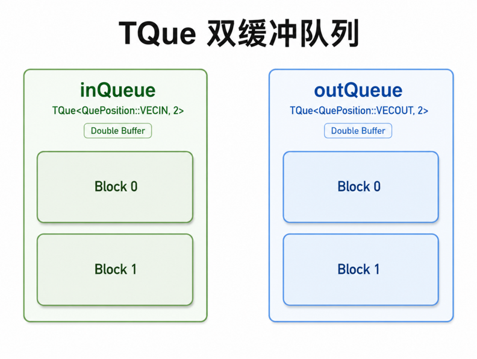
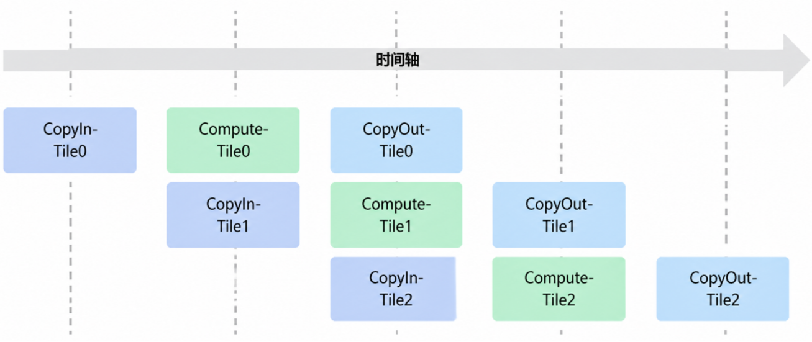
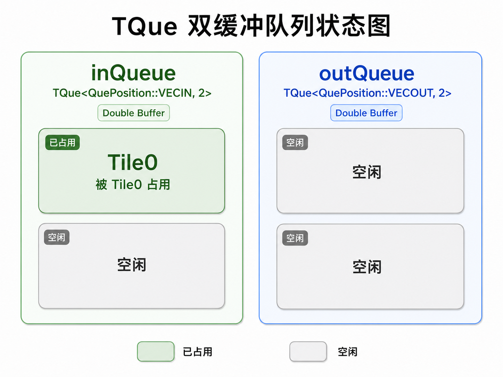
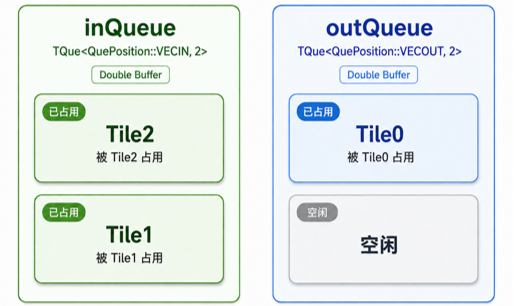
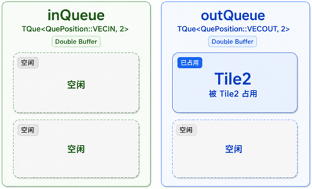

### 第六节 TensorOJ 实战：Add Medium 的双缓冲流水线

本节继续实现 [TensorOJ Add Medium](https://tensoroj.cn/cann/pku-tensor/education/add-medium)，重点优化算子的执行效率。

在上一节中，Tile 循环虽然解决了片上 SRAM 溢出的问题，但 MTE 搬运引擎与 Vector 计算单元只能串行交替运行：Vector 计算时 MTE 只能闲置，MTE 搬运时 Vector 只能等待。

要消除这种硬件空转，核心在于**让“计算当前 Tile”与“搬运下一 Tile”同时进行**。然而在单缓冲区下，预读下一 Tile 会直接覆盖当前正在计算的片上数据，引发数据竞争。

本节将引入**双缓冲（Double Buffering）技术**：通过开辟两套可交替轮换的片上缓冲区（乒乓机制），实现内存搬运与向量计算的并发重叠，彻底拉满硬件算力利用率。

#### 一、传统顺序执行引发的硬件空转

在常规的单线程控制流中，算子执行通常遵循“数据搬入 $\to$ 向量计算 $\to$ 结果写回”的严格顺序。这种顺序安排会导致严重的硬件空转：

- **Vector 计算单元挂起**：当搬运引擎正在从 GM 搬运数据到片上 SRAM 时，Vector 单元因缺乏数据而闲置。
- **数据搬运引擎挂起**：当 Vector 单元对数据进行加法计算时，搬运引擎同样处于等待状态。

AI Core 的架构设计初衷，是让内部各个独立的硬件单元各自持续运转，而不是按部就班地相互等待。只要前后指令之间没有强制的数据依赖，后一条 Tile 的搬运指令完全可以在前一条 Tile 的计算尚未结束时提前发射并执行。

#### 二、昇腾芯片的核心硬件架构

在上一节中，我们看到了“数据搬运”与“向量计算”串行等待的性能痛点。要理解硬件为何具备并发重叠的能力，必须深入昇腾 AI 加速卡（Ascend AI Accelerator）的物理架构。

##### （一）核心计算单元：AIC、AIV 与 Scalar

昇腾 AI 加速卡采用模块化的异构计算核心设计，将不同类型的计算任务分派给最擅长的硬件单元：

- **AIC（AI Cube Core，矩阵计算核）**：集成了专门的 **Cube 矩阵计算单元**，专注于高密度的**矩阵乘法（GEMM）与张量卷积**。
- **AIV（AI Vector Core，向量计算核）**：集成了 **Vector 向量计算单元**，专注于 **向量计算与逐元素（Element-wise）运算**，例如 `Add`、`Relu`。
- **Scalar（标量计算单元）**：无论是 AIC 还是 AIV 内部，都集成了负责控制流的 **Scalar 单元**。它不直接处理海量张量计算，而是专门负责运行标量代码、维护 `for` 循环、计算 Tile 内存偏移量，并将指令发射到对应的硬件队列中。

##### （二）MTE 的物理独立管道与片上存储层级

许多开发者容易把“数据搬运”误以为是一条单向的通用通道。实际上在昇腾硬件架构中，负责数据搬运的 **MTE（Memory Transfer Engine）引擎被划分为多条物理上完全独立的管道**：

- **MTE2 管道（GM $\to$ UB 搬入）**：专门负责将输入数据从全局内存（GM）搬运到片上统一缓冲区（UB）。MTE2 拥有独立的 DMA 控制硬件，其搬运过程完全不占用 Vector 计算单元和 MTE3 管道。
- **MTE3 管道（UB $\to$ GM 写回）**：专门负责将片上 UB 计算完成的输出数据写回到全局内存（GM）。MTE3 管道与 MTE2 管道完全解耦，这意味着在向 GM 写回结果的同时，MTE2 管道可以并行从 GM 搬运下一批输入。
- **MTE1 与 FixPipe 管道（Cube 专用通路）**：在包含矩阵运算的 AIC 架构中，还存在负责将数据从 L1 缓存搬运到 L0A/L0B 缓冲区的 **MTE1 管道**，以及负责量化和格式转换的 **FixPipe 管道**。本节的 `Add` 算子主要基于 AIV 运行，核心涉及 MTE2 与 MTE3。


*图 6-1：AI Core 的 AIC/AIV 硬件划分，以及 GM、UB 与各级存储之间的数据搬运通路。*

硬件上独立运行的 **MTE2、MTE3 与 Vector** 三条物理管道，为算子的高速并行提供了底座保障。

#### 三、异步指令流：控制与执行解耦的多流水线架构

传统的 CPU 程序采用**顺序控制流**：下一条指令通常需要等待上一条指令计算完毕后才能推进。

而昇腾 AI Core 采用的是**控制流与执行流解耦的异步指令流架构**。Scalar 单元仅负责控制逻辑与指令分发，实际的搬运和计算任务则交由底层的多条独立硬件流水线异步执行。

##### （一）Scalar 的异步指令投递

Scalar 单元在 AI Core 中扮演着**调度总指挥**的角色。它不需要等待耗时的数据搬运或复杂的向量计算完成，而是以极高的频率顺序解析 Kernel 代码。

一旦 Scalar 识别出某条指令属于数据搬运，便会将其瞬间投递（Dispatch）至 `PIPE_MTE2` 队列；紧接着遇到向量计算指令，又会立即将其入队至 `PIPE_V`。

这种“只管投递、无需等待”的异步分发模式，使得控制流能够远远走在实际硬件执行的前头，彻底解放了 Scalar 单元的调度效能。

##### （二）独立硬件队列的并发推进

被 Scalar 投递出去的指令，会分别进入各自硬件模块的专属 FIFO（先入先出）队列中：

- **`PIPE_MTE2` 队列**：独立驱动 MTE2 引擎，专职从 GM 向 UB 异步拉取数据。
- **`PIPE_V` 队列**：独立驱动 Vector 计算单元，专职在 UB 内部对数据进行向量计算。
- **`PIPE_MTE3` 队列**：独立驱动 MTE3 引擎，专职将 UB 内计算好的结果异步推送回 GM。


*图 6-2：Scalar 发射指令；Vector、Cube 与 DMA 搬运单元通过各自队列执行。指令流可以并行推进，数据依赖仍需要同步关系约束。*

因为这三条指令队列在硬件层面物理隔离、互不干扰，**MTE2 搬运引擎在处理 `PIPE_MTE2` 里的搬运任务时，Vector 单元可以同时读取 `PIPE_V` 里的计算任务**。这就是异步指令流实现数据搬运与计算并发重叠的根本原因。

前面聚焦的是 Add 实际使用的三条队列。为了建立完整的 AI Core 指令队列视角，下面列出主要队列、对应硬件与调度职责；其中 `PIPE_M`、`PIPE_MTE1` 与 `PIPE_FIX` 会在后续矩阵算子中发挥作用。

| 队列名称 | 对应硬件单元 | 指令类型与典型操作 | 硬件调度角色 |
| --- | --- | --- | --- |
| `PIPE_S` | Scalar 标量单元 | 控制流、循环、标量算术、地址与 Tile 偏移计算 | 解析并发射各类指令，为其他队列准备控制参数。 |
| `PIPE_M` | Cube 矩阵单元 | 矩阵计算指令，例如矩阵乘加 $C = A \times B + bias$ | 执行高吞吐矩阵运算；Add 不直接使用该队列。 |
| `PIPE_V` | Vector 向量单元 | SIMD 向量运算，例如 `Add`、`Exp`、`Softmax` | 对 UB 中的数据执行逐元素计算、激活和归一化等向量操作。 |
| `PIPE_MTE2` | MTE2 搬运引擎 | 外存到片上存储的数据搬运：GM $\rightarrow$ UB/L1 | 输入搬入通路，负责预取下一 Tile 的输入数据。 |
| `PIPE_MTE1` | MTE1 搬运引擎 | 片上 Buffer 间的数据搬运：L1 $\rightarrow$ L0A/L0B 等 | 为 Cube 矩阵计算准备片上数据；Add 不直接使用该队列。 |
| `PIPE_MTE3` | MTE3 搬运引擎 | 片上存储到外存的数据搬运：UB/LOC $\rightarrow$ GM | 结果写回通路，负责将完成计算的 Tile 写回全局内存。 |
| `PIPE_FIX` | FixPipe 格式处理单元 | 格式转换、量化/反量化、结果处理与写回 | 连接矩阵计算与后续处理；Add 不直接使用该队列。 |

##### （三）异步指令流引发的数据竞争

在多队列异步架构下，指令入队的顺序并不代表指令执行完成的顺序。由于各硬件队列完全独立运行，搬运与计算的执行延时差异巨大；若缺乏显式的同步控制，就会引发严重的数据乱序风险。

假设有一段未加任何同步控制的简单算子伪代码：

```cpp
// 假设无同步控制的伪代码。
read(x, global_x);    // 1. 发射到 PIPE_MTE2：从主存读 x 到片上 UB。
exp(y, x);            // 2. 发射到 PIPE_V：对 UB 中的 x 求指数，结果存入 y。
write(global_y, y);   // 3. 发射到 PIPE_MTE3：将 UB 中的 y 写回主存。
```

当这段代码由 Scalar 单元顺序发射后，底层可能发生典型的数据读写乱序：

- **极速投递**：Scalar 单元在极短时间内把三条指令分别投递到 `PIPE_MTE2`、`PIPE_V` 和 `PIPE_MTE3` 三个独立队列中。
- **硬件抢跑**：GM 搬运 `read` 的物理延时较高；`PIPE_V` 队列中的 `exp` 指令可能在 `read` 仍等待显存响应时就开始执行。
- **脏读报错**：此时 `x` 尚未从 GM 搬运完成，Vector 单元读取 UB 时得到的是未经初始化的数据；同理，MTE3 也可能提前将尚未计算完成的 `y` 写回主存。

异步指令流在硬件层面打通了“边搬运、边计算”的重叠跑道，但硬件本身并不识别数据依赖。如何保障数据安全，完全取决于软件层的同步控制与内存隔离。

在接下来的双缓冲设计中，我们将通过为相邻 Tile 开辟独立的 UB 工作区，彻底解除跨 Tile 搬运与计算之间的数据竞争，让硬件的重叠并发能力真正落到实处。

#### 四、双缓冲（Double Buffering）机制：片上内存的乒乓重叠

在前两节中，我们拆解了昇腾 AI 加速卡的硬件结构与异步指令流。硬件上独立的 MTE2、Vector 与 MTE3 提供了并发重叠的客观条件；而真正解决数据竞争、在软件层面建立“缓冲区隔离”的核心手段，就是双缓冲（Double Buffering）技术。

##### （一）Ascend C 编程模型中的双缓冲抽象

在 Ascend C 的 C++ 高阶 API 中，Unified Buffer（UB）的管理并不是由开发者手动计算指针偏移量，而是通过逻辑队列 `TQue` 与管道内存管理对象 `TPipe` 共同完成。结合框架架构图，Ascend C 将双缓冲抽象为带深度（Buffer Depth）的内存队列：

```cpp
// 1. 声明数据输入队列（QuePosition::VECIN），缓冲区深度设为 2（开启双缓冲）
TQue<QuePosition::VECIN, 2> inQueue;

// 2. 声明数据输出队列（QuePosition::VECOUT），缓冲区深度设为 2（开启双缓冲）
TQue<QuePosition::VECOUT, 2> outQueue;
```



*图 6-3：TQue 双缓冲队列拓扑（`inQueue` 与 `outQueue` 内部均包含 Block 0 与 Block 1 两块独立的片上工作区）。*

当模板参数中的深度设置为 `2` 时，`TQue` 逻辑队列会在 UB 内存中自动切分出两块大小完全一致、物理地址互不干扰的存储槽位：Block 0 与 Block 1。

##### （二）片上内存分配：`TPipe::InitBuffer` 的双缓冲控制

声明队列模板后，需要在算子初始化阶段（通常在 `Init` 函数中）调用 `TPipe` 的 `InitBuffer` 接口对 UB 空间进行真正的物理划分。结合框架初始化伪代码：

```cpp
// 利用 TPipe 分配片上 UB 内存（Buffer Depth = 2 开启 Double Buffer 双缓冲）
pipe.InitBuffer(inQueue, 2, this->tileLength * sizeof(half));
pipe.InitBuffer(outQueue, 2, this->tileLength * sizeof(half));
```

接口参数说明：

- **第一个参数（队列对象）**：绑定对应的 `TQue` 句柄，例如 `inQueue` 或 `outQueue`。
- **第二个参数（`bufferNum` / 深度）**：设置为 `1` 时为单缓冲区模式，底层只在 UB 中分配 1 块大小为 `tileLength * sizeof(half)` 的空间；设置为 `2` 时开启双缓冲模式，框架会在 UB 中申请两倍的物理内存空间，即自动分配 Block 0 与 Block 1。
- **第三个参数（`len` / 单个 Block 大小）**：指定单个缓冲区 Block 的字节长度，此处为单个 Tile 处理的数据字节量，即 `tileLength * sizeof(half)`。

**内存占用提醒**：开启双缓冲（`bufferNum = 2`）时，算子在 UB 上占用的实际片上内存为 $2 \times \text{len}$。因此在设计 Tile 大小（`tileLength`）时，必须注意单个队列总容量不能超出芯片硬件 UB 的上限。

##### （三）双缓冲乒乓流水线状态推演

为了更直观地理解双缓冲如何实现“数据搬运与计算的流水线重叠”，下面追踪 3 个 Tile（Tile0、Tile1、Tile2）在执行过程中的时间轴，以及片上逻辑队列 `inQueue` 和 `outQueue` 内部缓冲区的动态占用状态。

在深度为 `2` 的双缓冲机制下，`inQueue` 和 `outQueue` 各自拥有两个独立的存储槽位，即 **Block 0** 与 **Block 1**。



*图 6-4：CopyIn、Compute 与 CopyOut 在不同 Tile 上交叠推进。*

##### （1）时间段 1：预热准备阶段（CopyIn-Tile0）

流水线刚启动，硬件首先进行数据预取：

- **流水线动作**：MTE2 搬运引擎执行 `CopyIn-Tile0`，将 Tile0 的数据从 GM 搬运到片上 UB。
- **`TQue` 状态演进**：
  - **`inQueue`**：Block 0 入队，标记为 **“已占用（Tile0）”**；Block 1 维持 **“空闲”**。
  - **`outQueue`**：Block 0 与 Block 1 均处于 **“空闲”** 状态。



*图 6-5：Tile0 搬入后，`inQueue` 的 Block 0 被占用。*

##### （2）时间段 3：稳定重叠峰值阶段（CopyOut-Tile0 / Compute-Tile1 / CopyIn-Tile2）

当流水线推进到时间段 3 时，三条独立硬件管道达到了完全充盈的状态，展现出双缓冲的最高重叠效率：

1. **MTE3 引擎**：执行 `CopyOut-Tile0`，将 Tile0 在 UB 中计算好的结果写回 GM。
2. **Vector 单元**：执行 `Compute-Tile1`，对 Tile1 进行向量计算。
3. **MTE2 引擎**：执行 `CopyIn-Tile2`，提前预读 Tile2 的数据到片上内存。

此时，`inQueue` 中的 Tile1 正在被 Vector 单元读取使用，占用 Block 1；MTE2 则将 Tile2 搬入 Block 0。两个 Block 都被有效使用。`outQueue` 中，Tile0 的结果仍驻留在 Block 0，等待 MTE3 完成写回。



*图 6-6：读、算、写同时推进，输入队列两块缓冲区均被占用。*

##### （3）时间段 5：收尾清空阶段（CopyOut-Tile2）

所有 Tile 的搬入与计算均已完成，流水线进入最后的写回收尾：

- **流水线动作**：MTE2 与 Vector 单元均已完成各自使命，仅由 MTE3 引擎执行 `CopyOut-Tile2`，将最后一个 Tile 的计算结果推回 GM。
- **`TQue` 状态演进**：
  - **`inQueue`**：所有输入 Tile 已消费完毕并全部出队释放，Block 0 与 Block 1 恢复为 **“空闲”**。
  - **`outQueue`**：Tile2 的结果正驻留在 Block 0 中，标记为 **“已占用（Tile2）”**；待 MTE3 完成写回后，整个队列将完全清空。



*图 6-7：最后一个 Tile 写回期间，输入队列已清空。*
