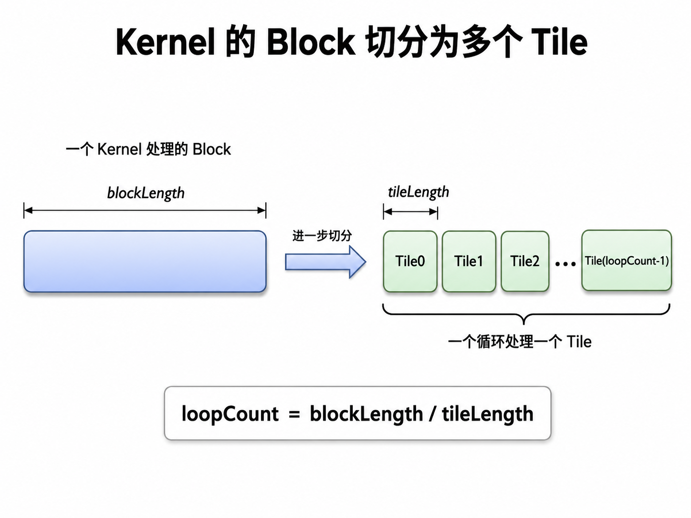
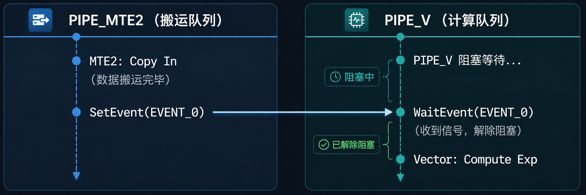
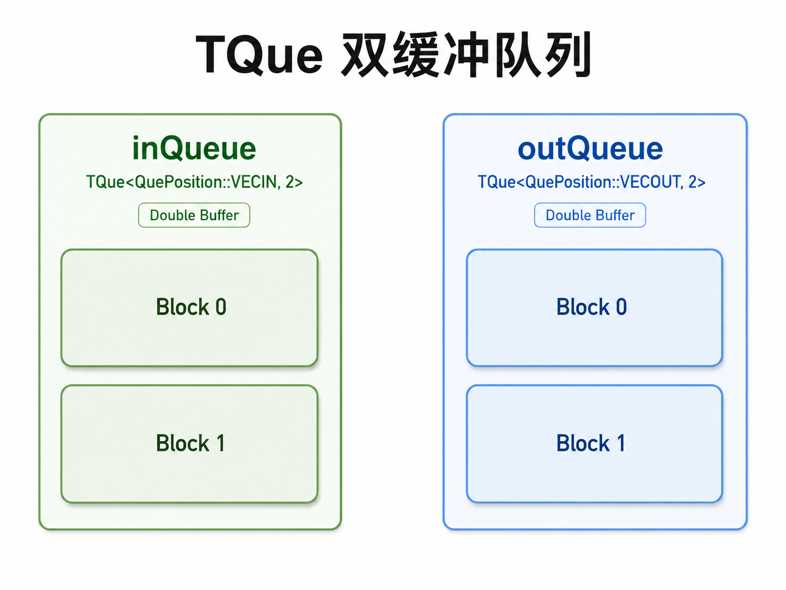
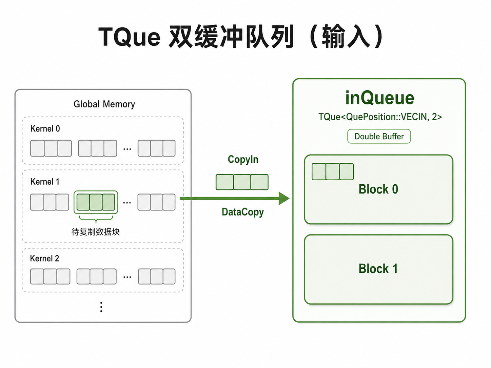
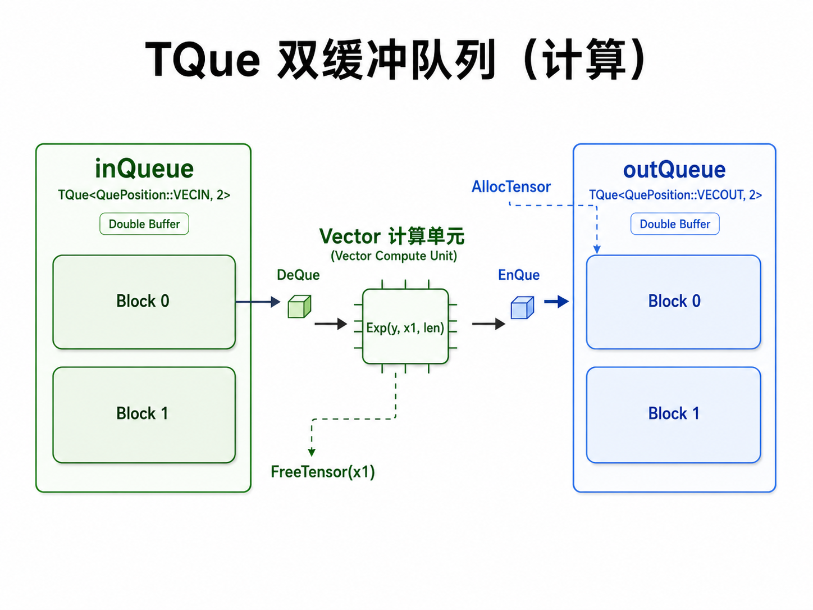
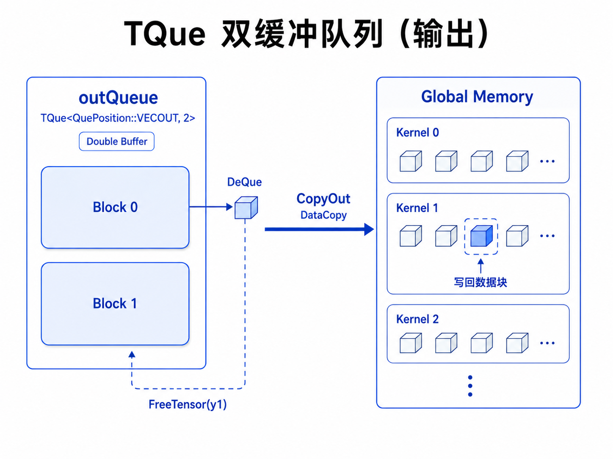

### 第五节 Add Medium：双缓冲与 TQue 流水线

第四节中，每个 Block 依次处理 8 个 Tile。一个 Tile 的执行顺序是：

```text
搬入 Tile i -> 计算 Tile i -> 写回 Tile i -> 搬入 Tile i + 1
```

这个版本结果正确、结构清晰，但有一个明显空档：向量计算单元在等待下一块数据从 GM 搬入 UB 时会空闲；搬运单元在计算时也可能空闲。双缓冲的目标不是改变 Add 的结果，而是让这些硬件阶段尽可能同时工作。

#### 一、单缓冲为什么会出现空档

第四节为一个 Tile 准备了三块 UB：`xLocal`、`yLocal`、`zLocal`。由于只有这一组缓冲区，Tile `i` 还在计算时，Tile `i + 1` 没有地方安全地搬入；否则会覆盖正在被计算读取的 `xLocal`、`yLocal`。

```text
时间 ->
GM -> UB:  [搬入 Tile 0]          [搬入 Tile 1]          [搬入 Tile 2]
Vector :                 [计算 Tile 0]          [计算 Tile 1]
UB -> GM:                              [写回 Tile 0]          [写回 Tile 1]

单缓冲：同一组 UB 反复使用，阶段之间大多只能等待。
```


*一个 Kernel Block 负责一段连续元素；这段元素继续被切成多个 Tile，循环处理。*

#### 二、异步执行带来的依赖问题

在 AI Core 中，搬入、向量计算、写回会发往不同硬件流水线。例如，GM 到 UB 的搬运通常由 MTE2 负责，Add 由向量流水线负责，UB 到 GM 的写回由 MTE3 负责。不同流水线能够并行，执行速度却不相同。

因此，双缓冲不是简单地“把 Buffer 数改成 2”。它还必须保证三条依赖：

1. Tile `i` 的搬入完成后，才能计算 Tile `i`。
2. Tile `i` 的计算完成后，才能写回 Tile `i`。
3. 某个缓冲区写回完成并归还后，才能装入后续 Tile。

底层可以通过事件同步表达这些依赖：搬运阶段记录完成事件，计算阶段等待它；计算阶段记录完成事件，写回阶段再等待它。


*MTE2 完成 CopyIn 后记录事件；向量流水线等待该事件，确认 UB 数据就绪后才开始计算。*

#### 三、TPipe 与 TQue 分别解决什么问题

Ascend C 的 C++ API 用 `TPipe` 管理 UB 空间，用 `TQue` 管理同一类 Tile 缓冲区的生产与消费顺序。

```text
TPipe：在 UB 中划出缓冲区。
TQue ：将缓冲区组织为先进先出的队列，并在阶段之间传递 LocalTensor。
```

对于 Add，需要三条队列：

| 队列 | 保存的数据 | 生产阶段 | 消费阶段 |
| --- | --- | --- | --- |
| `inQueueX` | x 的 Tile | CopyIn | Compute |
| `inQueueY` | y 的 Tile | CopyIn | Compute |
| `outQueueZ` | z 的 Tile | Compute | CopyOut |


*示意图中的 Block 0、Block 1 是同一队列的两块轮换 Buffer；输入数据与输出结果分别沿各自队列流动。*

队列中一个 Tile 的生命周期如下：

```text
AllocTensor -> 填入数据 -> EnQue -> DeQue -> 使用 -> FreeTensor
```

- `AllocTensor`：向队列申请一块空闲 UB。
- `EnQue`：声明该 Tile 已准备好，交给下游阶段。
- `DeQue`：下游阶段取得最早准备好的 Tile。
- `FreeTensor`：阶段用完后归还 UB，供后续 Tile 再利用。


*CopyIn 从 GM 的当前 Tile 区间读取连续元素，填入一块空闲输入 Buffer；填满后再入队。*

#### 四、从单缓冲变成双缓冲

单缓冲时，每条队列深度为 `1`：

```cpp
constexpr uint32_t BUFFER_NUM = 1;
pipe.InitBuffer(inQueueX, BUFFER_NUM, TILE_LENGTH * sizeof(float));
pipe.InitBuffer(inQueueY, BUFFER_NUM, TILE_LENGTH * sizeof(float));
pipe.InitBuffer(outQueueZ, BUFFER_NUM, TILE_LENGTH * sizeof(float));
```

双缓冲只改变一个关键参数：每条队列深度改为 `2`。

```cpp
constexpr uint32_t BUFFER_NUM = 2;
pipe.InitBuffer(inQueueX, BUFFER_NUM, TILE_LENGTH * sizeof(float));
pipe.InitBuffer(inQueueY, BUFFER_NUM, TILE_LENGTH * sizeof(float));
pipe.InitBuffer(outQueueZ, BUFFER_NUM, TILE_LENGTH * sizeof(float));
```

此时每条队列拥有 Buffer 0 和 Buffer 1。当前计算 Tile `i` 时，CopyIn 可以把 Tile `i + 1` 搬到另一块空闲 Buffer；当前写回 Tile `i - 1` 时，向量单元仍可继续计算 Tile `i`。

`BUFFER_NUM = 2` 表示每条队列同时保留两块可轮换的 Tile Buffer，而不是将同一块 UB 重复覆盖。

#### 五、UB 容量必须重新计算

第四节的 `TILE_LENGTH = 8192`，一个 `float32` Tile 为：

$$
8192 \times 4\ \text{B} = 32\ \text{KB}
$$

双缓冲下，`x`、`y`、`z` 三条队列各有两块 Buffer：

$$
3 \times 2 \times 8192 \times 4\ \text{B} = 196608\ \text{B} = 192\ \text{KB}
$$

这比单缓冲的 `96 KB` 多一倍。双缓冲能换取流水线重叠，但不能超过设备和运行时可用的 UB 预算；实际算子还要为对齐、临时结果和系统保留空间留出余量。

#### 六、稳态流水线中，三个阶段同时工作

设当前处于稳定阶段，三个硬件流水线处理不同 Tile：

```text
MTE2 / CopyIn : 搬入 Tile i + 1
Vector        : 计算 Tile i
MTE3 / CopyOut: 写回 Tile i - 1
```

它们访问的是不同的 Buffer，因此没有覆盖冲突。时间线上可以写成：

```text
时间 ->
CopyIn :  [T0] [T1] [T2] [T3] [T4] ...
Compute:       [T0] [T1] [T2] [T3] ...
CopyOut:            [T0] [T1] [T2] ...
```

第一个 Tile 只能先搬入，最后一个 Tile 也必须等待写回，因此开头和结尾仍有少量空档。Tile 数较多时，中间的稳态阶段占比更高，双缓冲通常更有价值。


*Compute 取出已经搬入的输入 Buffer，完成 Add 后立刻归还输入 Buffer；结果 Tile 则放进输出队列等待写回。*

#### 七、代码结构如何变化

第四节的 C API 代码适合说明 Tile 的串行路径。第五节切换到 C++ API，不是为了算子注册，而是为了使用 `TPipe + TQue` 描述 UB 的多缓冲与阶段交接。

单缓冲的外层逻辑是：

```cpp
for (uint32_t i = 0; i < TILE_NUM; ++i) {
    CopyIn(i);
    Compute(i);
    CopyOut(i);
}
```

双缓冲仍保留同样的循环外形：

```cpp
for (uint32_t i = 0; i < TILE_NUM; ++i) {
    CopyIn(i);
    Compute(i);
    CopyOut(i);
}
```

区别在于：`CopyIn`、`Compute`、`CopyOut` 操作的是深度为 `2` 的队列。队列和运行时事件会追踪依赖，允许三个函数所发出的不同流水线任务重叠执行；不应手工让 Tile `i + 1` 覆盖 Tile `i` 的 LocalTensor。


*CopyOut 从输出队列取走一个已完成的 z Tile，写回对应 GM 区间，再归还该输出 Buffer。*

#### 八、双缓冲并不总会加速

双缓冲主要隐藏的是搬运与计算的等待时间。效果取决于三个阶段的耗时：

| 情况 | 可能现象 |
| --- | --- |
| CopyIn 很慢，Compute 很快 | 搬运仍是瓶颈；双缓冲可减少计算单元等待，但不能消除带宽限制 |
| Compute 很慢，搬运较快 | 向量计算是瓶颈；双缓冲主要减少搬运阶段空闲 |
| 三阶段耗时接近 | 重叠最充分，通常最值得使用双缓冲 |
| Tile 数很少 | 启动和收尾占比高，收益可能不明显 |
| UB 预算不足 | 无法使用深度为 2 的队列，需要减小 Tile 或保持单缓冲 |

因此，优化后应通过 profiling 比较第四节与第五节的 Kernel 耗时，而不是只依据代码结构判断快慢。

#### 九、本节结论

- Tile 解决“一个 Block 的数据能否放入 UB”；双缓冲解决“搬运与计算能否同时推进”。
- `TQue` 本身是队列抽象；将队列深度设为 `2`，才为相邻 Tile 提供两套可轮换的 UB Buffer。
- 正确性来自队列与事件表达的数据依赖，不来自盲目并行。
- 第五节保持直接启动 Kernel 的形式；没有引入算子注册。
- 下一步可以将这套双缓冲结构用于更复杂的算子，观察不同 Tile 长度、不同 Buffer 深度对性能的影响。
